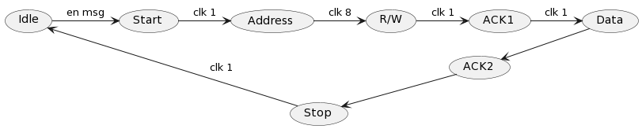

# Buszustände

## Nachrichtenaufbau

5 Bit für 21 Zustände:

|Bit(s)|Description |
|------|------------|
|0     |Start Symbol|
|1-8   |Address     |
|9     |Read/Write  |
|10    |Acknoledge  |
|11-18 |Data        |
|19    |Acknoledge  |
|20    |Stop Symbol |

---------------------------------

## Zustände

- Idle
- sende Start
- sende Adresse
- sende Nachrichtenrichtung
- sende Acknowledge
- sende Datenbyte
- sende Acknowledge
- sende Stop
- Idle

---------------------------------
